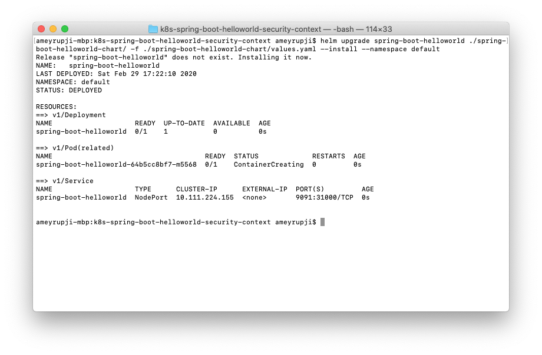
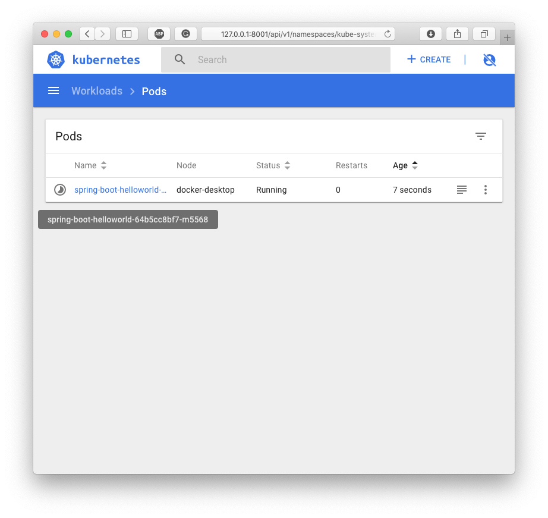
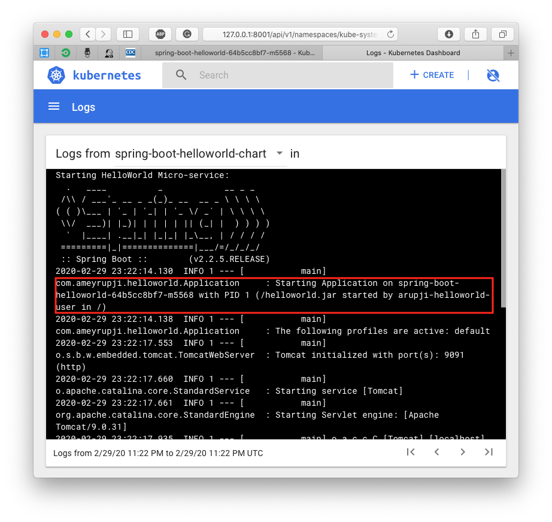
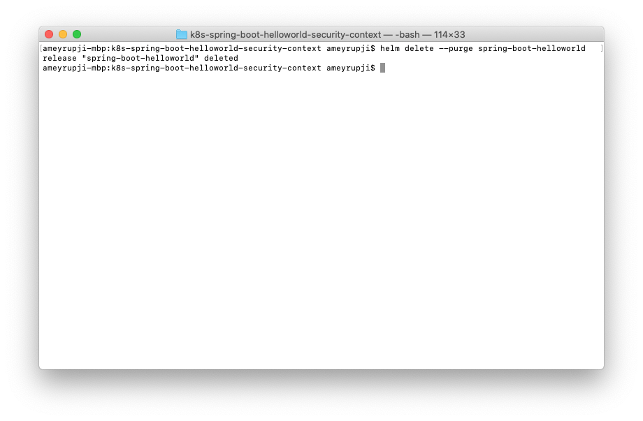

| [◂ Previous](https://github.com/ameyrupji-k8s/k8s-spring-boot-helloworld-liveness-readiness-probes) |
|-----|

# k8s-spring-boot-helloworld-security-context

Taking the Kubernetes Spring Boot Hello World Application further with liveness readiness probes added. This example adds Security Context settings while deploying to kubernetes cluster. A security context defines privilege and access control settings for a Pod or Container

Read more about security context click [here](https://kubernetes.io/docs/tasks/configure-pod-container/security-context/).


## Prerequisites

- Java IDE (I am using IntelliJ CE)
- Maven
- Docker
- Helm
- Tiller on the Kubernetes cluster

## System Configuration at time of test

- macOS Catalina - Version 10.15.3 (19D76)
- IntelliJ CE - Version CE 2019.3
- Maven - Version 3.6.1
- Docker Desktop - Version 2.2.0.3 (42716)
- Kubernetes - v1.15.5
- Helm - v2.14.3

## Initial Setup


### Adding User and Group to Docker Container

Add the following lines to `Dockerfile` before the procfile command is called.

```docker
RUN addgroup -g 1988 arupji-helloworld-group
RUN adduser -D -s / -u 1988 arupji-helloworld-user -G arupji-helloworld-group

RUN chown 1988:1988 helloworld.jar \
&& chown 1988:1988 procfile

USER 1988
```

This creates an User and Group with id `1988`. Gives ownership of the `helloworld.jar` and `procfile`. More might be required for specific use cases. Also sets the context to user with id 1988 with the command `USER 1988`.

### Adding Security Context

Add this code to this spring-boot-helloworld-chart/templates/deployment.yaml in the spec.template.spec section

```yaml
      securityContext:
        runAsNonRoot: true
        runAsUser: 1988
        fsGroup: 1988

```

Similar to the above comment. This starts the pod as a non root user and with user and group id `1988`


**Note:** Rebuild your docker container using docker build -t spring-boot-helloworld:v1 . as there is a slight change also to the `Dockerfile` which now calls a `procfile` on container initialization.

## Test 

Install container using helm command

`helm upgrade spring-boot-helloworld ./spring-boot-helloworld-chart/ -f ./spring-boot-helloworld-chart/values.yaml --install --namespace default`





Checking the pod logs we can see that this is running as `arupji-helloworld-user` that we created.



## Cleanup

To stop the container that is running use this command: `helm delete --purge spring-boot-helloworld`




## Useful links

- https://kubernetes.io/docs/tasks/configure-pod-container/security-context/

| [Next ▸](https://github.com/ameyrupji-k8s/k8s-spring-boot-helloworld-scaling) |
|-----|
